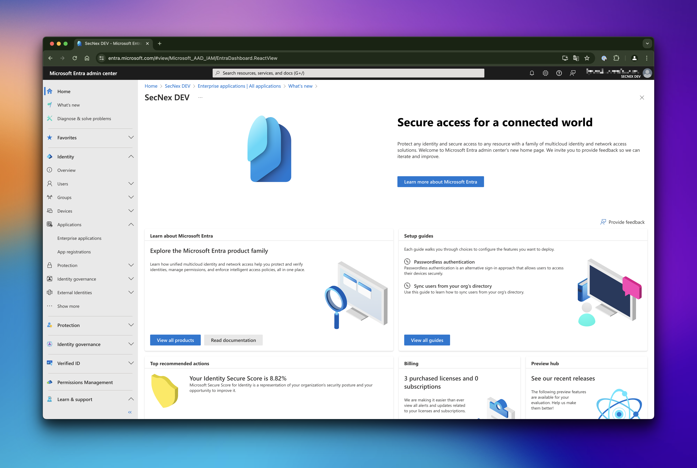

# Power BI

Power BI is a business analytics service by Microsoft. It aims to provide interactive visualizations and business intelligence capabilities with an interface simple enough for end users to create their own reports and dashboards.

With the **Headless Player** by [SecNex](https://secnex.io), you can easily embed Power BI reports and dashboards in your applications, websites, and more. This allows you to stream screenshots of Power BI reports in real-time without any browser-engine dependencies.

## Configuration

To get started with Power BI in the **Headless Player**, you need to configure the following settings:

### Create enterprise application in Entra index

For the authentication, you need to create an enterprise application in Entra index. This application will be used to authenticate the Power BI API and doesn't need any user interaction. You dont't need to permit any permissions to the application.

1. Go to [Entra ID](https://entra.microsoft.com) and sign in with your account.

2. Go to the **Enterprise applications** tab and click on **New application**.

3. Enter the name of the application and click on **Create**.

4. Copy the **Application (client) ID** and **Directory (tenant) ID**.

5. Change to the **App registrations** tab and select the application you just created.

6. Go to the **Certificates & secrets** tab and click on **New client secret**.

7. Enter a description for the secret and click on **Add**.

8. Copy the **Value** of the secret. **Important:** This value will be shown only once.