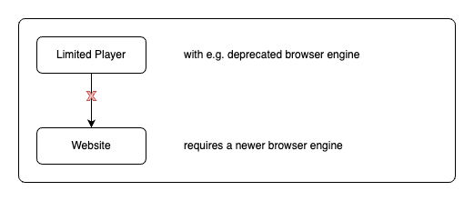

# Architecture

## What is the problem?

When you have a client, which should show a website, you need a supported browser engine. This can be a problem, because the browser engine can be outdated or not supported by the website. This can lead to a bad user experience.

## How does the Headless Player solve this problem?

The Headless Player is a standalone tool that can be used in any environment, including serverless functions, Docker containers, and more. It allows you to stream screenshots of any website in real-time without any browser-engine dependencies.
We have a server, which runs the browser engine and a client, which shows the website. The server streams the screenshots to the client with a WebSocket connection.

## Multiple microservices

With a lot of microservices, we have a any scaliability and can easily add new features. The Headless Player consists of the following microservices:

- **Server**: The server runs the browser engine and streams the screenshots to the client. All screenshots are stored in a memory cache for a short time.
- **Client**: The client shows the website with the screenshots from the server. The client can be a web application, a mobile application, or any other application that can display images.
- **API**: The API is a RESTful API that allows you to interact with the Headless Player. You can use the API to start and stop the player, get the status of the player, and more.
- **Power BI**: With the Power BI extension, you can easily embed Power BI reports and dashboards in your applications, websites, and more. This allows you to stream screenshots of Power BI reports in real-time without any browser-engine dependencies. We supported authentication with Entra ID and you can select any report page and use the filters and bookmarks.

## Security

The **Headless Player** is designed with security in mind. All communication between all microservices is encrypted with HTTPS. The server runs in a Docker container and is isolated from the host system. The server has no access to the file system and can only access the memory cache. The client has no access to the server and can only receive the screenshots. The authentication between the client and the server is using a OAuth2 similar process. Any request to the API needs a valid token and the token is only valid for a short time.